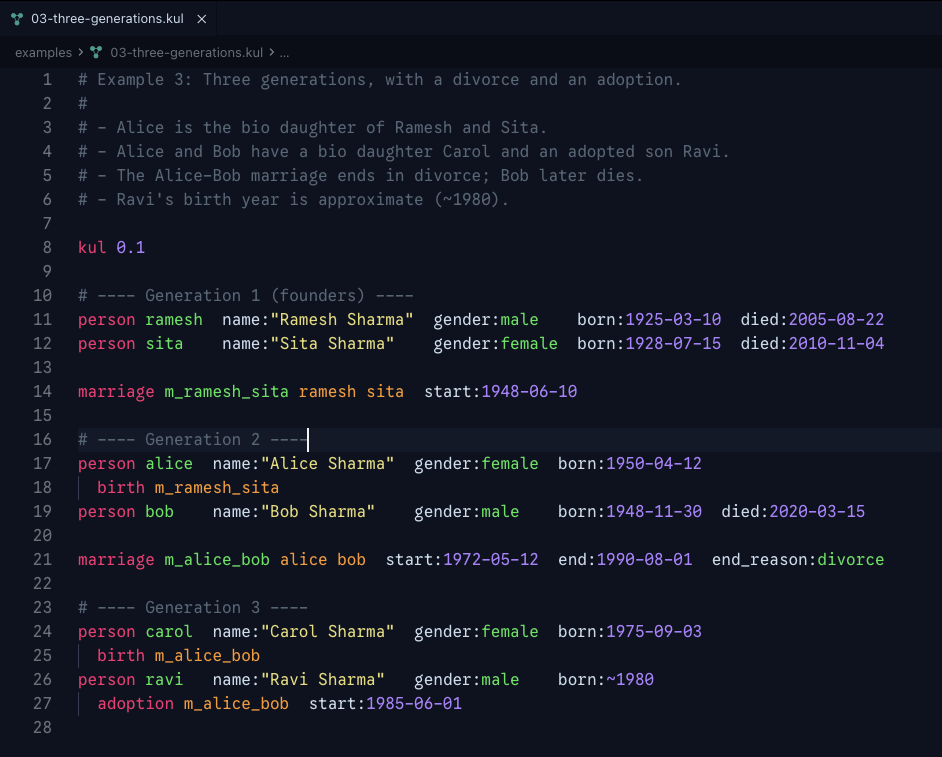

# KulaLang for VSCode

Syntax highlighting and editor support for [Kula](https://github.com/YashBhalodi/kulalang) (`.kula`) kinship-description files.



This extension lives inside the [kulalang](https://github.com/YashBhalodi/kulalang) repo. See the [language specification](https://github.com/YashBhalodi/kulalang/tree/main/spec) and [examples](https://github.com/YashBhalodi/kulalang/tree/main/examples).

## Features

- File association and file-tree icon for `.kula`
- Line-comment toggling (`#`) and auto-closing string quotes
- Syntax highlighting for keywords, strings (with escapes), date literals (with `~` circa marker), field names, enum values (`male`/`female`/`other`/`divorce`), declared identifiers, and id references
- Snippets for the common shapes: `kula`, `person`, `marriage`, `birth`, `adoption`
- Format-on-save: `.kula` files are canonicalized via `kula format` whenever you save (override per workspace if you prefer manual formatting)
- **Language-server integration** when `kula-lsp` is available (pointed at via `kula.serverPath` for development; bundled in the published Open VSX release): live diagnostics, hover panels, go-to-definition, basic completion, document outline, find-references, rename, code actions, and document formatting
- **Export commands** — `Kula: Export to JSON` and `Kula: Export to Cytoscape JSON` (run from the command palette on any `.kula` file): projects the current document — *including unsaved edits* — through the language server's `kula/export` request and prompts for a save location. The JSON form is the canonical kinship-native shape ([spec §15](https://github.com/YashBhalodi/kulalang/tree/main/spec/15-export-schema.md)); the Cytoscape form is a `nodes`/`edges` projection loadable into Cytoscape.js, Sigma.js, vis-network, etc. If the document has errors the command surfaces a notification and points you at the Problems panel

## Settings

- `kula.serverPath` — absolute path to a `kula-lsp` binary. When set, overrides the bundled binary; useful for pointing at a locally-built `target/debug/kula-lsp`. Leave empty to use the bundled binary (when the extension ships with one).
- `kula.trace.server` — `off` / `messages` / `verbose`. Enables LSP message tracing in the `Kula LSP` output channel.

## Local development

### Option A — Dev-host (fastest iteration)

1. Open this directory (`editor/vscode/`) in VSCode.
2. Run `npm install` once.
3. Press `F5` to launch an Extension Development Host window with the extension loaded. The pre-launch task compiles the TypeScript bundle.
4. In the dev host, open any file from the repo's [`examples/`](https://github.com/YashBhalodi/kulalang/tree/main/examples) directory.

Closing the dev-host window unloads the extension. Best for iterating on the activation script — edits to `src/extension.ts` take effect on relaunch.

### Option B — Install a local `.vsix` into your real VSCode

Use this when you want the extension active across all your VSCode windows (not just the dev host) without publishing to Open VSX.

**One-time setup:**

```sh
npm i -g @vscode/vsce
cd editor/vscode
npm install
```

**Package and install:**

```sh
cd editor/vscode
npm run package                                       # produces kulalang-<version>.vsix
code --install-extension kulalang-<version>.vsix      # use --force to overwrite an existing install
```

`npm run package` invokes `vsce package`, which runs the `vscode:prepublish` script first (typecheck + esbuild bundle).

Reload VSCode (`Cmd+Shift+P` → `Developer: Reload Window`) for the change to take effect.

**Re-package after edits:**

```sh
npm run package && code --install-extension kulalang-<version>.vsix --force
```

**Uninstall:**

```sh
code --uninstall-extension YashBhalodi.kulalang
```

The generated `*.vsix` file is gitignored.

### Option C — Test the language server locally

The extension's LSP client looks for `kula-lsp` first via the `kula.serverPath` setting and then falls back to a bundled binary. The default `npm run package` produces an **unbundled** `.vsix` (fast, no network) — perfect for local-dev install. For development you'll want to point at your locally-built binary:

1. Build the language server from the repo root:

   ```sh
   cargo build -p kula-lsp
   ```

2. Note the absolute path of the produced binary (`<repo>/target/debug/kula-lsp`).

3. Install the extension via Option A or Option B.

4. In VSCode, open Settings (`Cmd+,`) → search `kula.serverPath` → paste the absolute path. (Or edit `settings.json` directly with `"kula.serverPath": "/absolute/path/to/target/debug/kula-lsp"`.)

5. Reload the window (`Cmd+Shift+P` → `Developer: Reload Window`).

6. Open any `examples/*.kula` file. You should see:

   - Red squiggles under errors as you type (live diagnostics)
   - Hover panels on keywords, identifiers, field names, and references
   - Cmd+click on a person ref or marriage ref jumps to the declaration
   - Autocomplete for keywords, field names, and enum values

To debug the language server itself, set `kula.trace.server` to `messages` or `verbose` and watch the `Kula LSP` output channel (`View → Output → Kula LSP`).

### Option D — Build a fully-bundled `.vsix` (production-style)

Use this to package an extension that ships pre-built `kula-lsp` binaries for all four target platforms (`linux-x64`, `darwin-x64`, `darwin-arm64`, `win32-x64`) — the form that goes to Open VSX (and that ships as `kulalang-<version>.vsix` on every GitHub Release).

This requires a published GitHub Release at tag `v<version>` (the unified release pipeline produces all binaries under one tag). For day-to-day development you don't need this — Option C with `kula.serverPath` is faster.

```sh
cd editor/vscode
npm install
npm run package:bundled                                # downloads binaries from the v<version> release, then vsce package
code --install-extension kulalang-<version>.vsix --force
```

End users installing the bundled `.vsix` don't need to set `kula.serverPath` — the extension auto-locates the right platform binary.

Override with `LSP_VERSION=<x.y.z> npm run fetch-server` if you need a release other than the one that matches `package.json`.

## Requirements

VSCode 1.85 or later. The extension targets Node 18+ via the bundled extension host.
